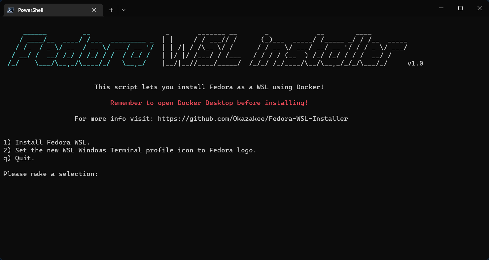

<h3 align="center"></h3>

---
Hello everyone! I am proud to announce my new utility!

I often use WSL to do stuff since I can't install Linux directly for reasons, and I noticed that there is no easy way to get Fedora, only Ubuntu or Debian etc... So after days of searching and finding nothing, I decided to create my own solution, at least I avoid going crazy and maybe others need it too.
### Usage

- Run `iex ((New-Object System.Net.WebClient).DownloadString('https://www.okazakee.dev/wsl-installer'))` in your powershell.
- Choose an option from menu.

### Requirements

- Powershell 7.
- Docker Desktop.

### Features

- Installs Fedora WSL.
- Change the WT profile icon.

### Working on:

- Automatically set start menu shortcut for WSL.
- Automatically check if Docker is running.
- Store vars in tmp file, check if it exists before asking user.
