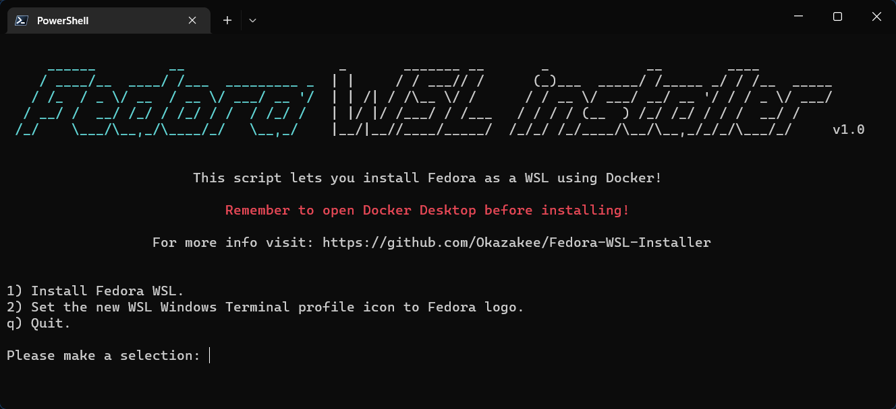

<h3 align="center"></h3>

---

### Usage

- Run `iex ((New-Object System.Net.WebClient).DownloadString('https://raw.githubusercontent.com/Okazakee/Fedora-WSL-Installer/main/Installer.ps1'))` in your powershell.
- Choose option from menu.

### Features

- Installs Fedora WSL.
- Change the WT profile icon.

### Requirements

- Powershell 7.
- Docker Desktop.
